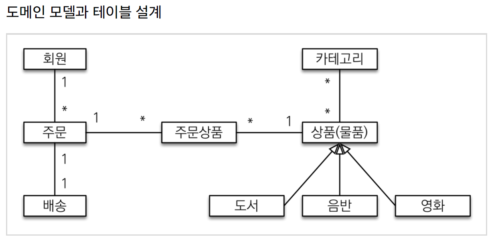
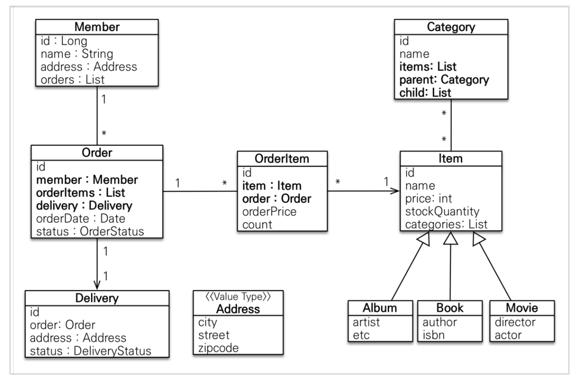
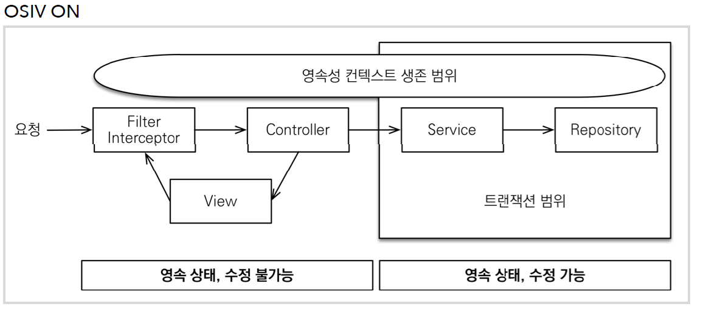
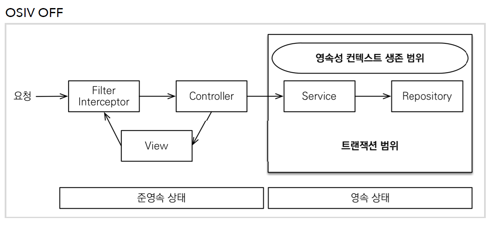

# JPA 연습 프로젝트 - SpringMVC, Thymeleaf, JPA

## 스프링부트 라이브러리 살펴보기

- spring-boot-starter-web
  - spring-boot-starter-tomcat: 톰캣 (웹서버)
  - spring-webmvc: 스프링 웹 MVC

* spring-boot-starter-thymeleaf: 타임리프 템플릿 엔진(View)
* spring-boot-starter-data-jpa
  - spring-boot-starter-aop
  - spring-boot-starter-jdbc
    - HikariCP 커넥션 풀 (부트 2.0 기본)
  - hibernate + JPA: 하이버네이트 + JPA
  - spring-data-jpa: 스프링 데이터 JPA
* spring-boot-starter(공통): 스프링 부트 + 스프링 코어 + 로깅

  - spring-boot
    - spring-core
  - spring-boot-starter-logging
    - logback, slf4j

* spring-boot-starter-test
  - junit : 테스트 프레임워크
  - mockito : 목 라이브러리
  - assertj : 테스트 코드를 편하게 작성할 수 있게 도와주는 라이브러리
  - spring-test : 스프링 통합 테스트 지원

<br><hr>

## JPA 기본 설정

```yml
spring:
  datasource:
    url: jdbc:h2:tcp://localhost/~/jpashop
    username: sa
    password:
    driver-class-name: org.h2.Driver
  jpa:
    hibernate:
      ddl-auto: create
    properties:
      hibernate:
        # show_sql: true
        format_sql: true
logging.level:
  org.hibernate.SQL: debug
  # org.hibernate.type: trace
```

- `org.hibernate.SQL` 는 logger를 통해 하이버네이트 실행 SQL을 남긴다.

- Gradle에 `implementation 'com.github.gavlyukovskiy:p6spy-spring-boot-starter:1.5.6'`를 추가하면 log를 `statement SQL`로 확인할 수 있다. (외부 라이브러리)

- 스프링 부트는 복잡한 설정을 자동으로 해준다. 따라서 `persistence.xml`을 작성할 필요도 없고, `LocalContainerEntityManagerFactoryBean`을 생성할 필요도 없다.

**외부 라이브러리를 사용할 때는 배포 전에 성능 테스트를 해보는 것이 좋다.**

<br><hr>

## 도메인 설계



- 다대다 관계는 중간에 엔티티를 하나 추가하고 일대다, 다대일 관계로 풀어내는 것이 좋다. `주문상품`의 경우만 해도 상품 개수, 총액 등 추가적으로 가져가야 할 컬럼이 많기 때문이다.

- 상품은 도서, 음반, 영화로 구분되는데 상품이라는 공통 특성을 사용하므로 상속 구조로 표현했다.



- `Address`는 값타입 객체이다.
- 실무에서는 `Order`가 `Member`를 참조하는 다대일 단방향으로 설계하는 것이 바람직해 보인다.

<br><hr>

## 도메인 설계시 팁

- `Entity`의 ID는 `ENTITY_ID`로 두는 것이 좋다.

- 외래키가 있는 곳을 `연관관계의 주인(@JoinColumn)`으로 정한다.

- `@Getter`는 열어두고 `@Setter`는 닫는다. Setter 대신 생성 메서드를 만들어 사용하거나 생성자를 사용한다. Setter를 닫는 이유는 엔티티가 어디서 변경했는지 추적하기가 어려워지기 때문이다.

- 양방향 연관관계의 경우 `연관관계 편의 메서드`를 만들어 사용한다.

- `Enum 타입`은 반드시 `@Enumerated(EnumType.STRING)`을 사용한다.

- `@ManyToMany`는 `@OneToMany` `@ManyToOne`으로 풀어서 사용한다.

- `@XXXToOne` 애노테이션은 fetch에 대한 전략이 `EAGER`이므로 `LAZY`로 전부 변경해서 사용한다.

- 엔티티 내부에 `List`를 사용할 경우 `new ArrayList<>()`로 공간을 미리 할당해놓는 것이 `NullPointerException`을 방지할 수 있다는 장점이 있다. 뿐만 아니라, 하이버네이트는 엔티티를 영속화할 때, 컬렉션을 감싸서 하이버네이트가 제공하는 내장 컬렉션으로 변경한다. 만약, 임의의 메소드에서 컬렉션을 잘못 변경한다면 하이버네이트 내부 매커니즘에 문제가 발생할 수도 있다. 따라서 필드레벨에서 생성하는 것이 바람직하다.

- 값 타입 객체는 변경이 불가능하도록 설계해야 한다. 따라서 `@Setter`를 지우고 생성자에서 값을 모두 초기화해서 변경이 불가능하도록 한다. JPA 스펙상 엔티티나 임베디드 타입은 자바 기본 생성자를 `public` 또는 `protected`로 설정해야 한다. 값 객체는 `protected`로 설정하는 것이 그나마 안전하다.

<br><hr>

## EntityManager, Transaction

- `EntityManager`는 `@PersistenceContext` 애노테이션을 붙이면 DI받을 수 있다. Spring boot에서는 `@Autowired`로도 주입받을 수 있도록 도와준다.

- 생성자 주입 방식은 `@Autowired`를 생략할 수 있으며, 테스트 시에 Mock객체를 주입해서 테스트할 수 있다는 장점이 있다. `ex) MemberService 객체를 생성자로 주입받자.`

- lombok을 사용할 경우 `@RequiredArgsConstructor`를 사용하면 `final`로 되어있는 빈을 자동으로 DI받는다.

```java
@RequiredArgsConstructor
public class MemberRepository{
    private final EntityManager em;
}
```

- `@Transactional` 애노테이션은 트랜잭션 즉, 영속성 컨텍스트의 생명주기로 봐도 된다. `readOnly=true`로 설정할 경우, 데이터의 변경이 없는 읽기 전용 메서드로 간주된다. 영속성 컨텍스트를 `flush` 하지 않기 때문에 약간의 성능이 향상된다.

<br><hr>

## Validation

- 회원 가입 시에 이미 가입된 유저인지 아닌지를 검증한다고 반드시 안전한 것은 아니다. 멀티 쓰레드 상황을 고려해서 유일해야 하는 컬럼에는 `UNIQUE` 제약조건을 반드시 걸어놓는 것이 좋다.

- 객체를 검증할 때는 `BindingResult` 객체와 함께 사용하는 것이 좋다.

<br><hr>

## Test

- 테스트는 `Given`, `When`, `Then` 세 단계로 나누어 작성하는 것이 좋다.

```java
@Test
public void 회원가입() throws Exception {
    //Given
    Member member = new Member();
    member.setName("kim");
    //When
    Long saveId = memberService.join(member);
    //Then
    assertEquals(member, memberRepository.findOne(saveId));
}
```

- 예외가 발생해야 하는 경우에는 `expected`를 사용한다.

```java
@Test(expected = IllegalStateException.class)
public void 중복_회원_예외() throws Exception {
    //Given
    Member member1 = new Member();
    member1.setName("kim");
    Member member2 = new Member();
    member2.setName("kim");
    //When
    memberService.join(member1);
    memberService.join(member2); //예외가 발생해야 한다.
    //Then
    fail("예외가 발생해야 한다.");
}
```

- test에서의 `@Transactional`은 트랜잭션을 시작하고 테스트가 끝나면 트랜잭션을 강제로 롤백하는 방식으로 테스트를 반복할 수 있게 도와준다.

- 테스트는 가급적 `인메모리 데이터베이스(h2)`를 사용해서 동작하는 것이 좋다. application.properties로 `dev`, `test`를 나누는 것이 좋아보인다.

<br><hr>

## 엔티티- 비즈니스 로직, 생성 메서드

### 비즈니스 로직

- JPA를 사용할 때는 비즈니스 로직을 엔티티에 포함시키는 방식이 유지보수와 테스트에 편리하다. 이렇게 객체지향의 특성을 적극 활용한 기법을 `도메인 모델 패턴`이라 부르며, 서비스 계층에서 대부분의 비즈니스 로직을 처리하는 것을 `트랜잭션 스크립트 패턴`이라고 부른다.

```java
public abstract class Item{

    ...

    //==비즈니스 로직==//
    public void addStock(int quantity) {
        this.stockQuantity += quantity;
    }
    public void removeStock(int quantity) {
        int restStock = this.stockQuantity - quantity;
        if (restStock < 0) {
            throw new NotEnoughStockException("need more stock");
    }
        this.stockQuantity = restStock;
    }
}
```

- Mybatis 같은 프레임워크는 `addStock`, `removeStock` 같이 단순한 기능에도 SQL문을 작성해야 하기 때문에 시간을 많이 낭비하게 된다. JPA는 `Dirty Checking` 이라는 기술 덕분에 SQL문을 작성하거나 하지 않아도 된다.

- 위의 예시처럼 `Custom exception`을 정의하는 경우 적당한 `Exception`을 상속받고, 생성자를 오버라이딩 해주는 것이 좋다. 오버라이딩 하는 이유는 에러에 대한 스택 트레이스를 나타내기 위함이다.

```java
public class NotEnoughStockException extends RuntimeException {
    public NotEnoughStockException() {
    }
    public NotEnoughStockException(String message) {
        super(message);
    }
    public NotEnoughStockException(String message, Throwable cause) {
        super(message, cause);
    }
    public NotEnoughStockException(Throwable cause) {
        super(cause);
    }
}
```

### 생성 메서드

- Setter를 사용하는 것대신 static 생성 메서드를 만들어 사용하는 것이 좋다.

```java
public static Order createOrder(Member member, Delivery delivery,
    OrderItem... orderItems) {
        Order order = new Order();
        order.setMember(member);
        order.setDelivery(delivery);
        for (OrderItem orderItem : orderItems) {
            order.addOrderItem(orderItem);
        }
        order.setStatus(OrderStatus.ORDER);
        order.setOrderDate(LocalDateTime.now());
        return order;
}
```

### 조회 로직

- 단순히 조회만 필요한 경우에도 메서드를 만들어 사용하는 것이 좋다.

```java
public int getTotalPrice() {
    int totalPrice = 0;
    for (OrderItem orderItem : orderItems) {
        totalPrice += orderItem.getTotalPrice();
    }
    return totalPrice;
}
```

- 실무에서는 `주문`에 전체 가격 필드를 두는 방식을 더 많이 사용한다.

<br><hr>

## 동적 쿼리

### JPQL

- JPQL은 동적쿼리 작성에 적합하지 않다. 다음 예시를 보자

```java
public List<Order> findAllByString(OrderSearch orderSearch) {
    String jpql = "select o From Order o join o.member m";
    boolean isFirstCondition = true;
    //주문 상태 검색
    if (orderSearch.getOrderStatus() != null) {
        if (isFirstCondition) {
            jpql += " where";
            isFirstCondition = false;
        } else {
            jpql += " and";
        }
        jpql += " o.status = :status";
    }
    //회원 이름 검색
    if (StringUtils.hasText(orderSearch.getMemberName())) {
        if (isFirstCondition) {
            jpql += " where";
            isFirstCondition = false;
        } else {
            jpql += " and";
        }
        jpql += " m.name like :name";
    }

    TypedQuery<Order> query = em.createQuery(jpql, Order.class)
                                .setMaxResults(1000); //최대 1000건
    if (orderSearch.getOrderStatus() != null) {
        query = query.setParameter("status", orderSearch.getOrderStatus());
    }
    if (StringUtils.hasText(orderSearch.getMemberName())) {
        query = query.setParameter("name", orderSearch.getMemberName());
    }
    return query.getResultList();
}
```

- 아주 복잡하다. 게다가 문자열이기 때문에 오타나 버그가 발생할 확률 또한 크다.

### JPA Criteria

- JPA의 동적 쿼리를 편하게(?) 작성할 수 있도록 도와주는 JPA 표준 스펙이다. 하지만 이 또한 너무 복잡하고 쿼리가 직관적이지 않다.

```java
public List<Order> findAllByCriteria(OrderSearch orderSearch) {
    CriteriaBuilder cb = em.getCriteriaBuilder();
    CriteriaQuery<Order> cq = cb.createQuery(Order.class);
    Root<Order> o = cq.from(Order.class);
    Join<Order, Member> m = o.join("member", JoinType.INNER); //회원과 조인
    List<Predicate> criteria = new ArrayList<>();
    //주문 상태 검색
    if (orderSearch.getOrderStatus() != null) {
        Predicate status = cb.equal(o.get("status"), orderSearch.getOrderStatus());
        criteria.add(status);
    }
    //회원 이름 검색
    if (StringUtils.hasText(orderSearch.getMemberName())) {
    Predicate name =
    cb.like(m.<String>get("name"), "%" +
    orderSearch.getMemberName() + "%");
    criteria.add(name);
    }
    cq.where(cb.and(criteria.toArray(new Predicate[criteria.size()])));
    TypedQuery<Order> query = em.createQuery(cq).setMaxResults(1000); //최대 1000건
    return query.getResultList();
}
```

- 이것도 상당히 복잡하고, 유지보수가 아주아주 어렵다. 따라서 QueryDSL을 쓰자!

<br><hr>

## 컨트롤러

- 컨트롤러에서 logger를 사용하고 싶으면 `Slf4j`의 구현체를 사용하는 것이 일반적이다. `lombok`을 사용하는 경우라면 `@Slf4j` 애노테이션을 추가하면 `log`를 사용할 수 있다.

- 스프링의 타임리프의 ViewName Mapping은 `resources:templates/` 라는 `prefix`와 `.html` 이라는 `suffix`가 View Name 앞뒤로 붙는다.

- 폼 객체를 사용해서 화면 계층과 서비스 계층을 명확하게 분리하는 것이 좋다. 실제 서비스에서는 사용자로부터 넘어오는 객체가 `Entity`와 다소 차이가 있을 확률이 매우 크며, Validation 또한 `Entity`와 `Form`에서 차이가 날 수 있다.

```java
@Getter @Setter
public class MemberForm {
    @NotEmpty(message = "회원 이름은 필수 입니다")
    private String name;
    private String city;
    private String street;
    private String zipcode;
}
```

- 마찬가지로 화면에 뿌려줄 데이터(Model)도 엔티티를 그대로 전달하는 것보다는 DTO로 만들어서 뿌려주는 것이 좋다. `Thymeleaf`를 쓰는 경우라면 보안상 문제는 없지만, API를 만드는 경우라면 보안상에도 문제가 있고, `API`의 스펙이 `Entity`에 의존하는 이상한 현상이 발생한다.

- `@Valid` 애노테이션과 BindingResult를 사용해서 타임리프에 에러 메시지를 공유할 수 있다. 객체로 바인딩하는 경우에는 `@ModelAttribute`를 사용할 수도 있다.

```java
@PostMapping(value = "/members/new")
public String create(@Valid MemberForm form, BindingResult result) {
    if (result.hasErrors()) {
        return "members/createMemberForm";
    }
    ...
```

- 화면과 객체를 계속해서 공유하고 싶다면 `ModelAttribute`를 사용하면 된다.

```java
@GetMapping("/orders")
public String orderList(
        @ModelAttribute("orderSearch") OrderSearch orderSearch,
        Model model)
{
    List<Order> orders = orderService.findOrders(orderSearch);

    model.addAttribute("orders", orders);
    return "orders/orderList";
}
```

- OrderSearch 객체를 만들지 않아도 자동으로 생성된다. 근데 왜 이전 프로젝트에서 안됐던 것 같지..?

<br><hr>

## 타임리프

여기에는 핵심보단 몰랐던 기능을 적어본다.

- `${T(jpabook.jpashop.domain.OrderStatus).values()}` 객체를 접근하는 방법인 것 같다.

```html
<option
  th:each="status : ${T(jpabook.jpashop.domain.OrderStatus).values()}"
  th:value="${status}"
  th:text="${status}"
  >option
</option>
```

- 객체가 null인지 아닌지 판단하는 방법으로 (.)을 제공한다. 아래 예시에서는 address가 null이면 그 이상 추적하지 않는다.

```html
<td th:text="${member.address?.city}"></td>
<td th:text="${member.address?.street}"></td>
<td th:text="${member.address?.zipcode}"></td>
```

- 외부 파일 추가하는 가장 쉬운 방법은 `th:replace` 이지만, 여러 파일에 걸쳐서 똑같은 코드가 반복되는 단점이 있다. 이런 중복을 제거하려면 `Hierarchical-style layouts`을 사용하면 된다.

<br><hr>

## Merge vs Dirty Checking

준영속 엔티티란 영속성 엔티티가 더는 관리하지 않는 엔티티를 의미한다. 화면 계층에서 전송한 Form 객체로부터 Entity 객체를 생성하게 되면 이 객체는 식별자(id)는 가지고 있지만, 영속성 컨텍스트가 관리하지 않기 때문에 준영속 엔티티로 볼 수 있다.

이러한 준영속 엔티티를 수정하는 방법은 크게 2가지로 나뉜다.

- 변경감지 기능
- 병합 사용

### 변경감지 기능

```java
@Transactional
void update(Item item) { //item: 파리미터로 넘어온 준영속 상태의 엔티티
    Item findItem = em.find(Item.class, item.getId()); //같은 엔티티를 조회한다.
    findItem.change(item.getPrice(), item.getCount()); //데이터를 수정한다.

    //파라미터가 많을 경우,
    // findItem.change(updateItem)
}
```

- 엔티티를 직접 조회해와서 변경할 값만 변경한다.
- 변경하고자 하는 파라미터의 개수가 너무 많아질 경우 별도의 객체를 생성해서 넘겨주도록 하자.

### 병합

병합은 준영속 상태의 엔티티를 영속 상태로 변경할 때 사용할 수 있다.

```java
@Transactional
void update(Item item) { //item: 파리미터로 넘어온 준영속 상태의 엔티티
    Item mergeItem = em.merge(item);
}
```

- 병합의 진행과정

1. 병합은 준영속 엔티티의 식별자 값으로 영속 엔티티를 조회한다.
2. 영속 엔티티의 값을 준영속 엔티티의 값으로 교체한다. (병합)
3. 트랜잭션 커밋 시점에 변경 감지 기능이 동작해서 데이터베이스에 UPDATE SQL이 실행된다.

**주의 : 변경 감지 기능을 사용하면 원하는 속성만 변경할 수 있지만, 병합을 사용하면 모든 속성이 변경된다. 병합시 값이 없으면 null로 업데이트 할 위험이 있다. 따라서 가급적 변경감지 기능을 사용하자.**

### 추천되는 해결 방법

**엔티티를 변경할 때에는 다음과 같은 방법으로 항상 변경 감지를 사용한다.**

1. 컨트롤러에서 어설프게 엔티티를 생성하지 말자.
   - 컨트롤러에서 생성한 엔티티는 영속성 컨텍스트의 관리 대상이 아니다. 하지만 서비스 계층에서는 이를 알기가 어렵다.
2. 트랜잭션이 있는 서비스 계층에 식별자(id)와 변경할 데이터를 명확하게 전달하자. (파라미터 or DTO)
3. 트랜잭션이 있는 서비스 계층에서 영속 엔티티를 조회하고, 엔티티의 데이터를 직접 변경하자.
4. 트랜잭션의 커밋 시점에 변경 감지가 실행된다.

<br><hr>

# API 설계 및 성능 최적화

## 회원 생성 API

**V1. 회원 생성 API : 엔티티를 RequestBody에 직접 매핑**

```java
@PostMapping("/api/v1/members")
public CreateMemberResponse saveMemberV1(@RequestBody @Valid Member member) {
	Long id = memberService.join(member);
	return new CreateMemberResponse(id);
}

@Data
@AllArgsConstructor
static class CreateMemberResponse {
    private Long id;
}
```

1. 이 API는 엔티티를 매개변수로 넘겨주고 있다. 프레젠테이션 계층에 대한 검증을 엔티티에서 처리하고 있기 때문에 엔티티 자체가 굉장히 복잡해질 수 있다. **가급적이면 프레젠테이션 계층의 로직을 엔티티와 분리해서 사용하는 것이 좋다.** 엔티티는 여러 계층에서 사용하기 때문에 사소한 수정에도 많은 사이드 이펙트가 발생할 가능성이 있기 때문이다.

2. **엔티티를 매개변수로 받을 경우 엔티티의 멤버변수가 바뀌거나 했을 때, API의 스펙자체가 바뀌어버릴 수 있다.** 예를 들어, name이라는 필드가 username 이라는 필드명으로 바뀌었다면 API 스펙 자체를 변경해야 한다.

3. API의 반환 타입도 별도의 객체로 정의해서 사용하는 것이 API의 스펙 변경에 대응하기가 쉽다. `CreateMemberResponse`는 `MemberApiController`에서만 사용하므로 내부 클래스로 정의해서 사용하는 것이 더 편리하고 정리하기 쉽다.

<br>

**V2. 회원생성 API : DTO를 RequestBody에 매핑**

```java
public MemberApiController{

    ...

    @PostMapping("/api/v2/members")
    public CreateMemberResponse saveMemberV2(@RequestBody @Valid CreateMemberRequest request) {
        Member member = new Member();
        member.setName(request.getName());

        Long id = memberService.join(member);
        return new CreateMemberResponse(id);
    }

    @Data
    static class CreateMemberRequest{
        @NotEmpty
        private String name;
    }

    @Data
    @AllArgsConstructor
    static class CreateMemberResponse {
        private Long id;
    }
}
```

1. 이렇게 API 스펙에 맞추어 Request, Response 객체를 만들어두는 것이 좋다.

2. DTO 객체를 만들어두면 프레젠테이션 계층에서 필요한 검증로직을 손쉽게 담을 수 있다.

3. DTO로부터 엔티티를 생성하는 방법은 굉장히 다양하다. 만약 생성 로직이 정말 단순하다면 생성자를 사용하는 것이 좋고, 생성할 때 무언가 비즈니스 로직이 필요하거나 의미있는 메서드 명이 필요하다면 생성자용 static 메서드를 사용한다. 만약 파라미터가 너무 많거나 복잡하면 빌더를 사용한다. 상황에 따라 가장 적합한 방법을 선택하자.

<br><hr>

## 회원수정 API

**V2. 회원수정 API**

```java
//Put은 같은 수정을 여러번 호출해도 변하지 않음.
@PutMapping("/api/v2/members/{id}")
public UpdateMemberResponse updateMemberV2(
        @PathVariable("id") Long id,
        @RequestBody @Valid UpdateMemberRequest request)
{
    memberService.update(id, request.getName());
    Member findMember = memberService.findOne(id);
    return new UpdateMemberResponse(findMember.getId(), findMember.getName());
}

@Data
@AllArgsConstructor
static class UpdateMemberResponse{
    private Long id;
    private String name;
}

@Data
static class UpdateMemberRequest{
    private String name;
}
```

1. REST API를 설계할 때 URI는 자원을 표현하는 데에만 집중하고 행위는 HTTP METHOD를 통해 나타내야 한다. PUT은 리소스를 수정할 때 사용하는 METHOD이므로 PUT을 사용하자.

2. 회원을 식별할 수 있는 식별자를 `PathVariable`로 받고, 변경하고자 하는 내용을 `UpdateMemberRequest` 라는 DTO 객체로 받고 있으며, `UpdateMemberResponse`라는 별도의 DTO 객체를 반환하는 것도 볼 수 있다. 이전 회원생성 API의 문제점을 잘 반영한 모습이다.

3. `memberService.update()`는 영속성 컨텍스트를 통해 엔티티를 가져오고, 그 엔티티를 변경하여 `Dirty Checking`으로 값을 바꾸는 메서드다. 그렇다면 `Member` 엔티티를 보유하고 있을텐데 왜 `update()`의 return 타입을 `Member`로 하지않았을까? 그 덕분에 `Member`를 조회하는 작업을 2번 진행하고 있다. 이런 단점을 감안하고도 return 타입을 `void` 또는 `id`로 두는 이유는 **커맨드와 쿼리**를 철저하게 분리하기 위함이다. `update`의 리턴값이 `Member`라면 `update`가 마치 쿼리를 호출한 것처럼 동작하기 때문에 유지보수 측면에서 단점이 있다. 김영한 개발자님은 이런 규칙을 철저하게 따르고 계신다고 한다.

4. 3번에서 각각의 `update()`와 `findOne()`의 트랜잭션이 다르기 때문에 서로 다른 영속성 컨텍스트를 사용한다고 배웠다. 그래서 우리는 조회 쿼리가 2번 발생할 것이라 예상하는 것이 당연하다. 하지만 로그를 확인해보면 조회 쿼리는 1번만 발생한다. 결론부터 말하자면 트랜잭션이 끝났음에도 불구하고 1차 캐시가 유지가 되고 있다. 그 이유에 대해서는 추후에 살펴볼 것이니 우선은 기억만 해두자!

5. `updateDto`에 변경할 수 있는 모든 필드를 멤버 변수로 가지고 있다면, 이 중에 일부는 null 값을 가질 수 있다. 이때는 값이 있는 필드를 null로 업데이트하지 않게 매번 체크하면서 수행해야 한다.

6. `memberService.update()`의 파라미터로 DTO를 넘겨줘도 되고, 각 필드변수를 넘겨줘도 된다. 필드변수를 하나씩 넘겨줬을 때의 장점은 재사용성이 높아진다는 것이고, DTO를 넘겨줬을 때의 장점은 매개변수가 많을 때 편리하다는 것이다. 따라서 `update` 필드가 많다면 DTO를 사용하고 그게 아니라면 매개변수를 사용하는 편이 좋지 않을까?

<br><hr>

## 회원 조회

**V1. 회원조회 API: 응답 값으로 엔티티를 직접 외부에 노출**

```java
@GetMapping("/api/v1/members")
public List<Member> membersV1(){
    return memberService.findMembers();
}
```

가장 단순한 조회 API이며, 엔티티를 반환하고 있으니 당연히 문제가 많다.

1. 먼저, 반환형에 `Member` 엔티티가 포함되어있으므로 엔티티의 정보가 그대로 노출되는 문제가 생긴다. `@JsonIgnore`를 이용해서 불필요한 데이터가 노출되지 않도록 설정할 수 있다. 이는 프레젠테이션 로직이 엔티티에 포함되는 문제도 있지만 더 심각한 문제가 있다. `A`라는 API에서는 필요로 하는 필드를 `B`라는 필드에서는 노출하지 말아야 한다면 어떡할까? 그냥 답이 없다. 따라서 반환형에 `Member`라는 엔티티를 노출하지말고 `Dto`를 만들어두는 것이 좋다.

2. 엔티티를 그대로 사용하고 있기 때문에 엔티티의 필드명이 바뀌거나 한다면 API 스펙자체가 바뀌어야 하는 문제가 발생한다.

3. 반환형 자체가 `List`이므로 Json으로 전달받았을 때에도, `[{}, {}, {}]`와 같은 형태로 전달된다. 따라서 API 요구사항이 바뀌어, 몇 개의 데이터가 조회했는지를 추가해야 한다고 해보자. 현재 `Generic`으로 `Member`만을 받고있기 때문에 데이터의 개수를 추가할 수 있는 공간이 없다. 따라서 우리는 `{ count : 5, data:[{},{}]}`와 같은 형태로 Json을 만드는 게 좋다.

**V2. 회원조회 API: 응답 값으로 엔티티가 아닌 별도의 DTO 사용**

```java
@GetMapping("/api/v2/members")
public Result memberV2() {
    //자바8 스펙.
    List<Member> findMembers = memberService.findMembers();
    List<MemberDto> collect = findMembers.stream()
                .map(m -> new MemberDto(m.getName()))
                .collect(Collectors.toList());

    return new Result(collect.size(), collect);
}

@Data
@AllArgsConstructor
static class Result<T>{
    private int count;
    private T data;
}

@Data
@AllArgsConstructor
static class MemberDto {
    private String name;
}
```

1. 영속성 컨텍스트로부터 조회해온 `Member` 엔티티를 `MemberDto`로 변환하고 있는 모습을 볼 수 있다. `Member`엔티티를 `MemberDto`로 변환할 때, `자바8` 의 stream을 이용하면 다소 편하게 구현이 가능하다.

2. 리턴타입은 `Result`라는 클래스로 컬렉션을 감싸서 향후 필요한 필드를 추가할 수 있다.

<br><hr>

# API 개발 고급 - 지연로딩과 조회성능 최적화

## 간단한 주문 조회

주문 + 배송정보 + 회원을 조회하는 API를 생성한다. `xToOne` 관계를 어떻게 최적화 할 수 있는지 알아보자.

- Order
- Order -> Member
- Order -> Delivery

**간단한 주문 조회 V1: 엔티티를 직접 노출**

```java
@RestController
@RequiredArgsConstructor
public class OrderSimpleApiController{

    private final OrderRepository orderRepository;

    @GetMapping("/api/v1/simple-orders")
	public List<Order> ordersV1(){
        List<Order> all = orderRepository.findAllByString(new OrderSearch());
        for(Order order : all) {
			order.getMember().getName();        //Lazy 강제 초기화
			order.getDelivery().getAddress();   //Lazy 강제 초기화
		}
		return all;
	}
}
```

1. 엔티티를 직접 노출하고 있기 때문에 `order`->`member`->`order`->`member`를 반복적으로 호출하는 무한루프에 빠지게 된다. 이 문제는 `@JsonIgnore`를 넣어 막을 수 있다. 양방향 연관관계의 경우에는 반드시 한쪽에 `@JsonIgnore`를 넣어 루프를 끊어줘야 한다.

2. 무한루프 문제를 `@JsonIgnore`로 해결하고 나면 `org.hibernate.proxy.pojo.bytebuddy...`로 시작하는 예외가 발생한다. 하이버네이트는 지연로딩일 때, `Member member = new ByteBuddyInterceptor()`처럼 프록시 객체를 삽입해두지만, `Jackson` 라이브러리는 이를 알지 못한다. `Jackson` 라이브러리는 프록시 객체를 `Json`으로 변환을 시도하지만, 실패하게 되고 발생하는 예외다. 이 문제를 처리하기 위해서는 `hibernate5Module`을 사용하면 된다.

3. `com.fasterxml.jackson.datatype:jackson-datatype-hibernate5`를 gradle에 추가하고 `hibernate5Module`을 반환하는 `@Bean`을 하나 생성한다. `hibernate5Module`이 빈으로 등록되면 초기화된 프록시 객체는 노출이 되지만, 초기화되지 않은 프록시는 null값을 가지게 된다.

4. 현재 Lazy loading으로 설정되어있으므로 `member`, `delivery` 또한 null로 반환된다. 페치전략을 EAGER로 바꿔서 가져오도록 할 수도 있고, 강제 초기화를 이용해서 초기화를 해둘 수도 있다. 위의 예제는 강제 초기화를 하는 예제이다.

V1은 절대로 만들어선 안되는 API다. **잘못만들면 이렇게나 복잡해지는구나** 생각하고 넘어가자.

**간단한 주문 조회 V2: 엔티티를 DTO로 변환**

```java
public class OrderSimpleApiController{

    @GetMapping("/api/v2/simple-orders")
    public OrderResult<List<OrderSimpleQueryDto>> ordersV2(){
        List<Order> orders = orderRepository.findAllByString(new OrderSearch()); //전체 조회
        List<OrderSimpleQueryDto> orderDto = orders.stream().map(o -> new OrderSimpleQueryDto(o)) 	//OrderSimpleQueryDto::new
                        .collect(Collectors.toList());

        return new OrderResult<List<OrderSimpleQueryDto>>(orderDto);
    }

    @Data
    @AllArgsConstructor
    static class OrderResult<T>{
    private T data;
    }
}
```

1. `Repository`로부터 조회된 엔티티들을 `OrderSimpleQueryDto`로 변환해서 return 하는 모습이다. 앞에서 `Collection` 자체를 반환하면 `Json`형식이 깨지기 때문에 `OrderResult<T>`로 컬렉션을 감싸준 기본에 충실한 API라고 할 수 있다.

2. 이 API의 단점은 `성능`이다. `orderRepository.findAll()`은 JPQL이 SQL로 그대로 번역돼서 `Order`만 조회하는 쿼리가 발생한다. 조회된 쿼리가 N개였다면, 각각의 쿼리에 대해서 `Member`와 `Delivery`를 조회해야 하기 때문에 `2N+1` 번의 쿼리가 발생한다. 물론 영속성 컨텍스트에 데이터가 있는 경우에는 쿼리가 발생하지 않기 때문에 실제 쿼리는 조금 더 적게 나갈 수는 있으나, 최악의 상황에는 `2N+1`번의 쿼리가 발생한다.

3. 참고로 페치전략을 `EAGER`로 바꾸면 `JOIN` 쿼리가 발생해서 성능 최적화가 되지 않을까? 생각할 수 있지만 전혀 아니다. 하지만 페치전략을 `EAGER`로 바꿨다 하더라도 `Order`에 대한 쿼리가 발생하고, `Member`와 `Delivery`에 대한 쿼리가 따로 발생한다. 물론 JPA가 내부적으로 더 복잡한 쿼리를 만들어 최적화할 수는 있지만, 이는 개발자가 예측하기가 너무나 힘들기 때문에 유지보수에서도 좋지 않다.

<br>

**간단한 주문 조회 V3: 엔티티를 DTO로 변환, 페치 조인 최적화**

```java
@GetMapping("/api/v3/simple-orders")
public OrderResult<List<OrderSimpleQueryDto>> ordersV3(){
    List<Order> orders = orderRepository.findAllWithMemberDelivery();
    List<OrderSimpleQueryDto> orderDto = orders.stream().map(OrderSimpleQueryDto::new)
    .collect(Collectors.toList());

    return new OrderResult<>(orderDto);
}


public class OrderRepository{
	public List<Order> findAllWithMemberDelivery() {
		return em.createQuery(
				"select o from Order o" +
				" join fetch o.member m"+
				" join fetch o.delivery d", Order.class)
		.getResultList();
    }
}
```

1. 페치 조인으로 `Order`를 조회할 때, `Member`와 `Delivery`를 한 번에 조회했기 때문에 쿼리는 1번만 발생한다. 조회된 결과를 단순히 Dto로 변환해서 클래스로 감싼 후 반환한 것이 전부다. 아주 심플하게 성능을 최적화했다고 볼 수 있다.

<br>

**간단한 주문 조회 V4: JPA에서 DTO로 바로 조회**

```java
@GetMapping("/api/v4/simple-orders")
public OrderResult<List<OrderSimpleQueryDto>> ordersV4(){
    return  new OrderResult<>(orderSimpleQueryRepository.findOrderDtos());
}


public class OrderSimpleQueryRepository {

    private final EntityManager em;

    public List<OrderSimpleQueryDto> findOrderDtos() {
        return em.createQuery(
                "select new jpabook.jpashop.repository.order.simplequery.OrderSimpleQueryDto(o.id, m.name, o.orderDate, o.status, d.address) from Order o" +
                " join o.member m" +
                " join o.delivery d", OrderSimpleQueryDto.class
                )
        .getResultList();
    }
}

@Data
public class OrderSimpleQueryDto {
	private Long orderId;
	private String name;
	private LocalDateTime orderDate;
	private OrderStatus orderStatus;
	private Address address;

	//Dto가 엔티티에 의존하는거는 ㄱㅊ
	public OrderSimpleQueryDto(Order order) {
		orderId = order.getId();
		name = order.getMember().getName();
		orderDate = order.getOrderDate();
		orderStatus = order.getStatus();
		address = order.getDelivery().getAddress();
	}

	public OrderSimpleQueryDto(Long orderId, String name, LocalDateTime orderDate, OrderStatus orderStatus, Address address) {
		this.orderId = orderId;
		this.name = name;
		this.orderDate = orderDate;
		this.orderStatus = orderStatus;
		this.address = address;
	}
}
```

1. JPQL의 join과 new를 이용해서 JPA에서 DTO로 바로 조회했다. 쿼리는 1번만 발생하며 `SELECT` 절에 불필요한 컬럼이 추가되지 않기 때문에 V3에 비해 약간의 성능 향상을 기대할 수 있다. 하지만, DTO를 바로 조회했기 때문에 해당 메서드 `findOrderDtos()`는 재활용성이 매우 낮다.

2. `Repository`는 엔티티를 조회하는 기능을 의미하는데, `findOrderDtos()`는 DTO를 조회하고 있으므로 `Repository`의 기능과 맞지 않다. 따라서 `repository.order.simplequery`와 같은 별도의 하위패키지를 구성하고 그 패키지 밑에 `OrderSimpleQueryRepository` 와 같이 별도의 객체를 두는 것이 좋다.

3. JPQL에서 new 연산자를 사용할 때, 객체를 넘겨주면 되지 않을까? 라는 생각을 할 수도 있다. 하지만 JPQL에서 객체를 넘겨주면 객체의 id값을 넘겨주는 것이기 때문에 원하는 대로 동작하지 않는다. 따라서 위의 예시처럼 매개변수를 하나씩 다 받는 생성자를 새로 정의해야 한다.

<br>

### 정리

엔티티를 DTO로 변환하거나, DTO로 바로 조회하는 두 가지 방법은 각각 장단점이 있다. 엔티티를 조회하면 리포지토리 재사용성도 좋고, 개발도 단순해진다. 따라서 다음 권장 순서를 지켜가며 개발하자.

**쿼리 방식 선택 권장 순서**

1. 엔티티를 DTO로 변환하는 방법을 선택한다.
2. 필요하면 페치 조인으로 성능을 최적화한다. (대부분의 성능이슈 해결)
3. 그래도 안되면 DTO로 직접 조회하는 방법을 선택한다.
4. 최후의 방법으로 JPA의 네이티브 쿼리를 사용하거나, 스프링 JDBC Template을 사용해서 SQL을 직접 사용한다.


_ref) API가 자주 조회되지 않는 ADMIN 페이지라면 Fetch Join으로 끝내도 좋고, 자주 조회되는 API라면 3,4번까지 진행해야 할 수 있다._

<br><hr>

# API 개발 고급 - 컬렉션 조회 최적화

간단한 주문 조회에서는 `xxxToOne`과 관련된 객체 그래프를 탐색했다. 이번에는 `OneToMany`를 포함해서 진행해보자. `OneToMany`는 `xxxToOne`보다 생각할 점과 조심해야 할점이 많다.

또, 앞으로 살펴볼 예제는 편의를 위해 `return` 값을 단순히 `Collection`으로 뒀다. 실무에서는 `Collection`을 감싸는 객체를 반환하도록 하자.

## 주문 조회

주문 + 배송정보 + 회원 + 주문 아이템 정보를 조회하는 API를 생성한다. `xToOne` 관계를 어떻게 최적화 할 수 있는지 알아보자.

- Order
- Order -> Member
- Order -> Delivery
- Order -> OrderItems -> Item

**주문 조회 V1:엔티티 직접노출**

```java
@GetMapping("/api/v1/orders")
public List<Order> ordersV1(){
    List<Order> all = orderRepository.findAllByString(new OrderSearch());
    for(Order order : all) {
        order.getMember().getName();                        //Lazy 강제 초기화
        order.getDelivery().getAddress();                   //Lazy 강제 초기화
        List<OrderItem> orderItems = order.getOrderItems();
        orderItems.forEach(o->o.getItem().getName());       //Lazy 강제 초기화
    }
    return all;
}
```

1. 양방향 참조를 끊기 위해 `@JsonIgnore`를 사용해야 하며, `Hibernate5Moudle`를 빈으로 등록해야 한다.

2. 기본 페치전략을 Lazy로 설정했기 때문에 위의 예시처럼 강제 초기화를 진행해준다.

3. 엔티티를 절대 외부에 노출하지 말자.

<br>

**주문 조회 V2:엔티티를 DTO로 변환**

```java
@GetMapping("/api/v2/orders")
public List<OrderDto> ordersV2(){
    List<Order> orders = orderRepository.findAllByString(new OrderSearch());
    List<OrderDto> result = orders.stream().map(o->new OrderDto(o))
                            .collect(Collectors.toList());
    
    return result;
}

@Data
static class OrderDto{
    private Long orderId;
    private String name;
    private LocalDateTime orderDate;
    private OrderStatus orderStatus;
    private Address address;
    private List<OrderItemDto> orderItems;
    
    public OrderDto(Order order) {
        orderId = order.getId();
        name = order.getMember().getName();
        orderDate = order.getOrderDate();
        orderStatus = order.getStatus();
        address = order.getDelivery().getAddress();
        /* 중요한 부분 */
        orderItems = order.getOrderItems().stream().map(o-> new OrderItemDto(o))
                    .collect(Collectors.toList());
    }
}

@Data
static class OrderItemDto {
    private String itemName; //상품명
    private int orderPrice;  //주문 가격
    private int count;		//주문 수량
    
    public OrderItemDto(OrderItem orderItem) {
        itemName = orderItem.getItem().getName();
        orderPrice = orderItem.getItem().getPrice();
        count = orderItem.getCount();
    }
}

```

1. 기존에 DTO를 사용하는 방식과 매우 유사하다. 하지만 조심해야 할 점이 하나 있다. 바로 `OrderItem`이라는 객체가 엔티티라는 점이다. DTO를 만들 때, `OrderDto`만 생성하지 말고, `OrderDto`의 필드인 `OrderItem` 또한 `OrderItemDto`를 새로 정의해야 한다. 이 부분에 유의하자.

2. V2 또한 `Lazy loading`이기 때문에 쿼리가 많이 발생할 것으로 예상할 수 있다. 만약 오더가 2건이고, 각 오더에는 상품이 2종류씩 있다고 해보자. 이 경우에는 오더 1개에 대해서 (Member 조회 + Delivery 조회 + OrderItems 조회(2건) + Items 조회(2건)) 이므로 약 11번의 SQL문이 발생할 것으로 예측할 수 있다.

<br>

**주문 조회 V3: 엔티티를 DTO로 변환, 페치 조인 최적화**

```java
@GetMapping("/api/v3/orders")
public List<OrderDto> ordersV3(){
    List<Order> orders = orderRepository.findAllWithItem();
    List<OrderDto> result = orders.stream().map(o->new OrderDto(o))
                        .collect(Collectors.toList());
    
    return result;
}

public class OrderRepository{
    public List<Order> findAllWithItem() {
    return em.createQuery(
            "select distinct o from Order o" +
            " join fetch o.member m"+
            " join fetch o.delivery d"+
            " join fetch o.orderItems oi"+	//OneToMany라서 질의된 데이터 양이 증가함.
            " join fetch oi.item i", Order.class)
            .getResultList();
    }
}
```

1. 이전과 동일하게 JPQL의 fetch join을 이용하면 발생하는 쿼리를 1개로 줄일 수 있다. 하지만 `OneToMany`에서는 주의해야 할 점이 있다. SQL Join에서 1:N 관계는 반드시 데이터의 양이 증가하게 된다는 점이다. 즉, 하나의 Order에 여러 개의 OrderItem이 N개 있다면 N개의 row가 생성된다. 이렇게 조회된 결과를 JPA가 Java의 `List`에 담아줄 때, Order 1개를 담아주는 것이 아니라 동일한 Order N개를 담아주게 된다. 물론 이 Order들은 동일한 식별자를 가졌고, 동일한 객체주소를 갖는다.

2. 위에서의 문제점을 극복하기 위해 JPQL에는 `distinct`를 제공한다. `distinct` 예약어는 2가지 기능을 제공하는데, 하나는 SQL문의 `distinct` 예약어와 동일한 기능(동일 튜플 제거)을 제공하고 다른 하나는 조회된 SQL 결과에서 동일한 엔티티를 제거하는 기능이다. 따라서 distinct 예약어만 붙여주면, 위의 예제에서 List에는 한 개의 Order만 담기게 된다.

3. 1:N 관계에서는 데이터의 양이 심각하게 증가할 수 있기 때문에 컬렉션 fetch join은 1개만 사용하는 것이 좋다. 그 이상의 fetch join은 사용하지 않는 것이 바람직하다.

4. 컬렉션을 페치조인 하는 경우에는 앞서 얘기했던 것처럼 row의 수가 예상치 못하게 증가할 수 있다. 우리의 목적은 `Order(일)`를 페이징하고 싶지만, 실제 페이징은 `OrderItem(다)`를 기준으로 이루어진다. 이러한 문제를 해결하기 위해 JPA는 약간의 `꼼수(?)`를 사용한다. 우리가 `Order`를 10개 조회하고 싶다고 `setFirstResult(0)`, `setMaxResult(10)`을 호출한다고 해서 `OFFSET`, `LIMIT` 같은 예약어가 발생하지 않는다. OFFSET, LIMIT으로는 우리가 원하는 `Order` 10개를 조회할 수 없기 때문이다. 따라서 JPA는 모든 `Order`를 조회해온 다음에, 이 모든 `Order`를 메모리에 올려 10개를 뽑아내는 방식을 사용한다. 따라서 결과는 우리가 원하는 대로 동작하는 것을 볼 수 있다. 하지만 주의해야 할점은 메모리에서 페이징을 한다는 것이다. 엄청나게 많은 데이터를 메모리에 올릴 경우 어떻게 될지 생각해보면... 컬렉션 페치조인에서는 절대로 페이징을 사용해서는 안된다. 이 문제점은 다음 버전에서 극복해보자.

<br>

**주문조회 V3.1:엔티티를 DTO로 변환, 페이징 한계 돌파**

1. `xxxToOne`을 페치조인으로 페이징해서 가져온다.
2. 컬렉션은 지연로딩으로 조회하는데, `BatchSize`를 지정해서 한 번에 설정한 size만큼 in 쿼리로 조회한다.

```java
// application.properties 설정
// spring.jpa.properties.hibernate.default_batch_fetch_size=100

@GetMapping("/api/v3.1/orders")
public List<OrderDto> ordersV3_paging(
        @RequestParam(value = "offset", defaultValue = "0") int offset,
        @RequestParam(value = "limit", defaultValue = "100") int limit)
{
    
    List<Order> orders = orderRepository.findAllWithMemberDelivery(offset, limit);
    List<OrderDto> result = orders.stream().map(o->new OrderDto(o))
                        .collect(Collectors.toList());
    
    return result;
}


public class OrderRepository{

    public List<Order> findAllWithMemberDelivery(int offset, int limit) {
    return em.createQuery(
            "select o from Order o" +
            " join fetch o.member m"+
            " join fetch o.delivery d", Order.class)
        .setFirstResult(offset)
        .setMaxResults(limit)
        .getResultList();
	}
}
```

1. `xxxToOne`은 쿼리 수를 증가시키지 않기 때문에 fetch join을 이용해서 한 번에 가져올 수 있다. 따라서 ```xxxToOne`과 함께 페치조인을 사용해서 원하는 데이터를 가져오고, 그 뒤에 컬렉션 부분만 `Lazy loading`을 한다. 하지만, Lazy loading을 한 건씩 가져오게 되면 `1+N` 문제에 직면하게 된다. 이 문제의 해결 방법이 위에서 사용한 `@BatchSize`이다. BatchSize는 IN 쿼리를 사용해서 한 번에 조회할 수 있는 데이터의 크기이다. 착각하지 말 것은 조회되는 데이터의 개수가 아니고, `IN (?, ?, ?)` 절에 들어가는 `?`의 개수다. 이 방법을 사용하면 `1 + N/BatchSize` 만큼으로 쿼리 수를 줄일 수 있다.

2. `V3`과 `V3.1`은 다소 차이가 있다. 페이징이 가능하냐 불가능하냐는 차이도 있지만, 데이터 전송량과 성능에 대해서도 생각해볼만 하다. 먼저 `V3`는 `fetch join`을 사용해서 쿼리 1번으로 데이터를 전부 조회하기 때문에 대부분의 상황에서 더 좋다고 볼 수 있다. 하지만, `V3`의 조회결과에는 중복된 데이터가 상당히 많이 저장된다. `Order` 하나에 `OrderItem`이 100개라면 동일한 내용의 `Order`가 100번 중복된다. 이 모든 데이터가 DB로부터 `WAS`로 전달되기 때문에 전송량이 많다는 단점이 있다. 반면에 `V.3.1`은 `V3`에 비해 더 많은 쿼리가 발생한다. 하지만 `V3.1`이 동작할 때 쿼리를 살펴보면 중복된 데이터를 전혀 조회하지 않는다는 것을 볼 수 있다. 즉, DB에서 애플리케이션에 전송되는 데이터 전송량은 `V3`에 비해 적다. 다시 말해 페이징을 제쳐놓고 본다면, `V3`과 `V3.1`은 데이터양과 트래픽의 `Trade off` 관계라고도 볼 수 있다.

3. `default_batch_fetch_size`의 크기는 100~1000 사이의 값으로 선택하는 것이 적당하다. 1000을 Max로 설정하는 이유는 데이터베이스의 종류에 따라서 IN 절 파라미터의 개수를 1000으로 제한하기도 하기 때문이다. 또 너무 작은 값으로 선택하면 지나치게 많은 트래픽이 발생하기 때문에 성능이 많이 저하될 수 있다. 우선 100과 1000의 각각의 장단점을 생각해보자. 1000이 100에 비해 성능면에서 우수한 것은 확실하다. 하지만 `1000`으로 설정하면 DB 조회 시간이 증가하고, 그 많은 데이터를 한 번에 애플리케이션으로 전달하기 때문에 애플리케이션에서 전달받고 처리하는 시간도 길다. 즉, 애플리케이션과 DB에 순간적인 부하가 발생한다. 결국 DB든 애플리케이션이든 순간 부하를 견딜 수 있는 한도 내에서 크게 설정하는 것이 좋다.

4. `default_batch_fetch_size`의 크기를 작은 사이즈로 사용한다고 해서 메모리 사용량이 줄어들거라는 착각을 하지 말자. 배치 사이즈가 작아도 결국 조회되는 최종 엔티티의 개수는 동일하기 때문에 서버의 메모리 사용량은 동일하다.

<br>

**주문 조회 V4: JPA에서 DTO로 바로 변환**

1. `xxxToOne` 관계를 미리 Fetch join을 사용해서 읽어온다.
2. 각 `Order`에 대해서 `OrderItem`을 조회해서 `Order`에 넣어준다.

```java
@GetMapping("/api/v4/orders")
public List<OrderQueryDto> ordersV4(){
    return orderQueryRepository.findOrderQueryDtos();
}

@Repository
@RequiredArgsConstructor
public class OrderQueryRepository{
    
    private final EntityManager em;

	public List<OrderQueryDto> findOrderQueryDtos() {
		List<OrderQueryDto> result = findOrders();          //xxxToOne 관계를 미리 Fetch 조인으로 다 읽어온다.
		result.forEach(o->{
			List<OrderItemQueryDto> orderItems = findOrderItems(o.getOrderId());    //OneToMany에 해당하는 부분을 조회하고 넣어준다.
			o.setOrderItems(orderItems);
		});
		
		return result;
    }
    
    private List<OrderItemQueryDto> findOrderItems(Long orderId) {
		return em.createQuery(
				"select new jpabook.jpashop.repository.order.query.OrderItemQueryDto(oi.order.id, i.name, oi.orderPrice, oi.count)"+
				" from OrderItem oi"+
				" join oi.item i"+
				" where oi.order.id = :orderId", OrderItemQueryDto.class)
				.setParameter("orderId", orderId)
				.getResultList();
	}

	private List<OrderQueryDto> findOrders() {
		return em.createQuery(
				"select new jpabook.jpashop.repository.order.query.OrderQueryDto(o.id, m.name, o.orderDate, o.status, d.address)"+
				" from Order o"+
				" join o.member m"+
				" join o.delivery d", OrderQueryDto.class)
		.getResultList();
	}
}
```

```java
@Data
@AllArgsConstructor
public class OrderItemQueryDto {
	@JsonIgnore
	private Long orderId;
	private String itemName;
	private int orderPrice;
	private int count;	

}

@Data
public class OrderQueryDto {
	
	private Long orderId;
	private String name;
	private LocalDateTime orderDate;
	private OrderStatus orderStatus;
	private Address address;
	private List<OrderItemQueryDto> orderItems;
	
	public OrderQueryDto(Long orderId, String name, LocalDateTime orderDate, OrderStatus orderStatus, Address address) {
		this.orderId = orderId;
		this.name = name;
		this.orderDate = orderDate;
		this.orderStatus = orderStatus;
		this.address = address;
	}
}
```

1. new 연산자는 `flat`한 데이터만 사용할 수 있다. 따라서 `OrderItem`에 대한 부분을 new 연산을 이용해 바로 삽입할 수 없다. 따라서 별도의 `OrderItem`을 조회하는 쿼리를 만들고 `OrderItem`을 조회한 후 `Order`에 삽입해준다. 이때 조회된 `Order`의 개수가 N개라면 추가로 N개의 쿼리가 발생하므로 `1+N`에 해당하는 쿼리가 발생하기 때문에 성능상 좋지 않다.

2. `OrderQueryRepository`는 DTO를 직접 조회하는 쿼리들이 모아져있는 저장소이며, 엔티티를 직접 조회하지 않기 때문에 기존의 `OrderRepository`와 분리해야 한다. 따라서 위의 예제에서는 `repository.order.query`라는 패키지 경로에 해당 클래스를 뒀다. 마찬가지로 DTO객체의 사용범위도 `repository.order.query`를 벗어나지 않기 때문에 해당 패키지 밑에 함께 두도록 한다.

3. 기존에 만들어둔 `OrderDto`를 사용하지 않는데에도 이유가 있다. 다른 API에서 사용하고 있는 `OrderDto`를  `OrderQueryRepository`에서 사용하게 되면, `OrderQueryRepository`가 `OrderApiController`를 참조하게 되기 때문에 이는 올바른 아키텍쳐라고 볼 수 없다.

<br>

**주문 조회 V5: JPA에서 DTO 직접조회, 컬렉션 조회 최적화**

1. `Order`와 `toOne`을 전부 Fetch join 해서 조회한다.
2. `OrderList`로부터 아이디만 추출해서 리스트로 만든다.
3. 만들어진 리스트를 가지고 `IN` 쿼리를 보내 연관된 모든 OrderItem을 조회한다.
4. 조회된 OrderItem들을 OrderId를 확인해서 Order에 넣어준다.

```java

public List<OrderQueryDto> ordersV5(){
    return orderQueryRepsitory.findAllByDto_optimization();
}


public class OrderQueryRepository{

    public List<OrderQueryDto> findAllByDto_optimization(){
        //루트 조회(toOne 코드를 Fetch Join)
        List<OrderQueryDto> result = findOrders();

        //OrderItems을 한번에 조회하고, OrderId를 key로 하는 Map으로 변환.
        Map<Long, List<OrderItemQueryDto>> orderItemMap = findOrderItemMap(toOrderIds(result));

        //Order에 OrderItems 셋팅
        result.forEach(o->o.setOrderItems(orderItemMap.get(o.getOrderId())));

        return result;
    }

    private List<Long> toOrderIds(List<OrderQueryDto> result){
        return result.stream()
                .map(o->o.getOrderId())
                .collect(Collectors.toList());
    }

    private Map<Long, List<OrderItemQueryDto>> findOrderItemMap(List<Long> orderIds) {
        List<OrderItemQueryDto> orderItems = em.createQuery(
                "select new " +
                "jpabook.jpashop.repository.order.query.OrderItemQueryDto(oi.order.id, i.name, oi.orderPrice, oi.count)" +
                " from OrderItem oi" +
                " join oi.item i" +
                " where oi.order.id in :orders", OrderItemQueryDto.class)
            .setParameter("orderIds", orderIds)
            .getResultList();
        
        return orderItems.stream().collect(Collcetors.groupingBy(oi->oi.getOrderId()));
    }
}
```

1. OrderItem을 IN 쿼리를 이용해서 한 번에 조회한다. 결국 엔티티의 `@BatchSize` 방식을 V5에서는 직접 구현했다고 볼 수 있다.

2. 쿼리는 2번만 발생하므로 효율적이고, select 절에서 필요한 컬럼만 가져오기 때문에 데이터 로딩 시에 부하가 적다. 단점으로는 재사용이 불가능한 쿼리이며, 애플리케이션 단에서 데이터를 조립(?) 해야 하기 때문에 코드가 제법 복잡하고, 유지보수성이 떨어진다.

<br>

**주문 조회 V6: JPA에서 직접 조회, 플랫 데이터 최적화**

1. OrderFlatDto를 만들어서 데이터베이스의 row를 한 줄 한 줄 그대로 받아 저장한다.
2. OrderFlatDto를 Map<OrderQueryDto, List<OrderItemQueryDto>>로 만들어준다. (groupingBy, mapping)
3. Map으로부터 List<OrderQueryDto>를 만들어준다.

```java
@GetMapping("/api/v6/orders")
public List<OrderQueryDto> ordersV6(){
    List<OrderFlatDto> flats = orderQueryRepository.findAllByDto_flat();
    
    Map<OrderQueryDto, List<OrderItemQueryDto>> collect = flats.stream().collect(Collectors.groupingBy(o-> new OrderQueryDto(o.getOrderId(), o.getName(), o.getOrderDate(), o.getOrderStatus(), o.getAddress()),
            Collectors.mapping(o-> new OrderItemQueryDto(o.getOrderId(), o.getItemName(), o.getOrderPrice(), o.getCount()), Collectors.toList())
            ));
    
    return collect.entrySet().stream()
            .map(e-> new OrderQueryDto(e.getKey().getOrderId(), e.getKey().getName(), e.getKey().getOrderDate(), e.getKey().getOrderStatus(), e.getKey().getAddress(), e.getValue()))
            .collect(Collectors.toList());
}


public List<OrderFlatDto> findAllByDto_flat() {
    return em.createQuery(
        "select new "+ PACKAGE_PATH + "OrderFlatDto(o.id, m.name, o.orderDate, o.status, d.address, i.name, oi.orderPrice, oi.count)" +
        " from Order o" +
        " join o.member m" +
        " join o.delivery d" +
        " join o.orderItems oi" +
        " join oi.item i", OrderFlatDto.class)
    .getResultList();
}
```

1. 쿼리는 총 1번 발생하지만, 중복 데이터가 많이 존재하기 때문에 반드시 V5보다 좋다고 볼 수는 없다. 게다가 V6는 페이징이 불가능하다.
2. 애플리케이션에서 데이터를 정리하는 과정이 복잡하고 시간이 꽤 걸린다는 단점이 있다.

<br>

### 정리

1. 엔티티 조회 방식으로 우선 접근
  1. 페치 조인으로 쿼리 수를 최적화.
  2. 컬렉션 최적화
    - 페이징 필요 : `hibernate.default_batch_fetch_size`, `@BatchSize`로 최적화
    - 페이징 필요 X : 페치 조인 사용
2. 엔티티 조회 방식으로 해결이 안되면 DTO 조회 방식 사용
3. DTO 조회 방식으로 해결이 안되면 `NativeSQL` 또는 `JdbcTemplate` 사용


참고 : 엔티티 조회 방식은 `페치조인`, `@BatchSize` 같이 코드를 거의 수정하지 않고 최적화를 시도할 수있지만, DTO 조회 방식은 성능최적화를 하거나 최적화 방식을 변경할 때 많은 코드를 변경해야 한다.

_cf) DTO 방식으로 조회해야 하는 경우라면 V4, V5가 선호되며, 엔티티로 조회하는 경우라면 V3, V3.1이 선호된다. V4같은 경우는 단건 조회에서는 성능에 전혀 이슈가 발생하지 않으며 코드가 직관적이라는 장점이 있다._

<br>

## OSIV와 성능 최적화

JPA가 나오기 전 Hibernate에서 `Open Session In View`를 줄여서 OSIV라고 부르기 시작했다. JPA가 개발되고 `Open EntityManager In View`라고 이름을 붙였지만 관례상 여전히 OSIV라고 한다.



- `spring.jpa.open-in-view = true`

Spring Data JPA는 default 값으로 OSIV를 true로 설정한다. OSIV가 켜져있으면, 영속성 컨텍스트의 라이프 사이클이 View Template을 만들 때까지도 살아있다. 이러한 이유로 우리는 Controller에서 지연로딩을 해올 수 있었다. 이는 코드를 유연하게 작성할 수 있다는 커다란 장점이 있다.

단점으로는 너무 오랫동안 데이터베이스 커넥션을 쥐고있다는 점이다. 뷰 템플릿을 만들고 리스폰스를 반환할 때까지 데이터베이스 커넥션을 쥐고 있기 때문에 결국은 커넥션풀에 커넥션이 모자르는 현상까지 이어질 수 있다. 심지어 컨트롤러에서 다른 외부 API를 호출하는 경우, 외부 API가 끝날 때까지 커넥션을 쥐고 있게 된다. 따라서 트래픽이 많다면 OSIV를 꺼두는 것이 좋다.



OSIV를 끄면 트랜잭션을 종료할 때 영속성 컨텍스트를 닫고 커넥션을 반환하기 때문에 리소스를 낭비하지 않는다. 하지만 OSIV를 끄면 모든 지연로딩을 트랜잭션 안에서 처리해야 한다. 컨트롤러와 뷰 템플릿에서 지연로딩이 불가능하기 때문에 Service 계층의 코드가 뷰 템플릿에 의존적이게 될 수 있다.

실무에서는 `Command`와 `Query`를 분리하는 방법으로 복잡성을 관리한다. 

- `OrderService` : 핵심 비즈니스 로직
- `OrderQueryService` : 화면이나 API에 맞춘 서비스 (주로 읽기 전용 트랜잭션)

_cf) 고객 서비스의 실시간 API에서는 OSIV를 끄고, ADMIN처럼 커넥션을 많이 사용하지 않는 곳에서 OSIV를 켠다._

<br><hr>